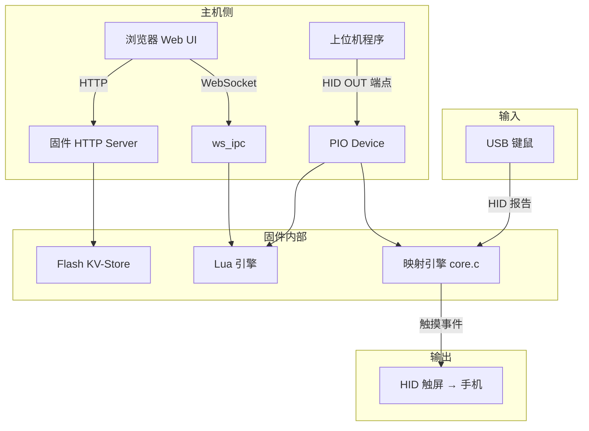

# API 文档

pico-hid-mapper 提供三层可编程接口：

| 接口 | 传输方式 | 用途 |
|------|----------|------|
| **HTTP REST API** | HTTP (端口 80) | 查询/设置设备状态、上传配置、管理槽位 |
| **Lua 脚本 API** | 固件内 Lua 5.4.6 | 自定义按键行为、编写宏、拦截映射事件 |
| **WebSocket** | ws://192.168.73.1/ws | 实时日志、向 Lua 发送文本事件 |

## 架构概览



## 配置格式

配置文件为 JSON 格式，描述映射规则。一个典型的配置片段：

```json
{
  "version": 1,
  "mappings": [
    {
      "type": "key",
      "keycode": 26,
      "action": "touch",
      "x": 0.5,
      "y": 0.5
    }
  ],
  "mouse": {
    "sensitivity": 1.0,
    "mode": "relative"
  },
  "wheel": {
    "directions": 9,
    "sprint_key": 225
  }
}
```

配置通过 Web UI 上传后自动写入 Flash KV-store，支持 9 个槽位。

## 快速导航

- **[HTTP API 参考](/api/http-api)** — REST 接口完整文档
- **[Lua 脚本 API](/api/lua-api)** — 板载 Lua 开发手册

## 网络参数

| 参数 | 值 |
|------|-----|
| Pico IP | `192.168.73.1` |
| 主机 IP | `192.168.73.2`（DHCP 自动） |
| 子网 | `192.168.73.0/24` |
| 协议 | RNDIS（虚拟网卡） |
| HTTP | `http://192.168.73.1/`（端口 80） |
| WebSocket | `ws://192.168.73.1/ws` |
