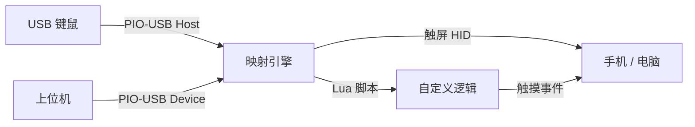

## 它能做什么？

**pico-hid-mapper** 是一个运行在 **微雪 RP2350-USB-C** 上的固件，它把 USB 键盘/鼠标的操作实时转成触摸屏事件。插上板子，手机以为你在触屏，实际是你在用键鼠。

典型场景：
- 🎮 **手游键鼠操控** — 用键盘 WASD 走位 + 鼠标控制视角
- 🔫 **射击游戏辅助** — Lua 脚本编写压枪宏、连点
- 🤖 **自动化脚本** — 通过 WebSocket / WebHID 发送自定义事件

## 硬件

  
  
<strong>微雪 RP2350-USB-C</strong>

无需焊接、无需杜邦线。板子自带双 USB-C 口：
- **原生 USB-C** → 连接手机/电脑（RNDIS 网卡 + HID 触屏）
- **PIO-USB-C** → 连接键盘鼠标（Host 模式）或上位机（Device 模式）

## 工作流

